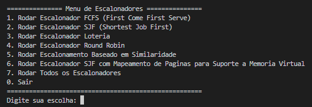

<h1 align="center" font-size="200em"><b>Simulador da Arquitetura Multicore de Von Neumann com Pipeline MIPS e Escalonadores</b></h1>

<!-- imagem -->

## 📋Execução dos Escalonadores

Este programa implementa um menu interativo que permite ao usuário escolher qual tipo de escalonador de processos deseja executar. Ele oferece suporte aos seguintes algoritmos de escalonamento:

1. **FCFS (First Come First Serve)** - Primeiro a Chegar, Primeiro a Ser Atendido.
2. **SJF (Shortest Job First)** - Menor Trabalho Primeiro.
3. **Loteria** - Escolhe processos aleatoriamente baseado em bilhetes de loteria.
4. **Round Robin** - Cada processo recebe uma fatia de tempo para execução em ordem circular.
5. **Todos os Algoritmos** - Executa todos os escalonadores em sequência, permitindo comparações entre os métodos.

---

## 🖥️Interação com o Menu
Ao iniciar o programa, você verá o seguinte menu:

- Digite o número correspondente ao escalonador que deseja executar e pressione **Enter**.

- O programa exibirá mensagens informando o progresso e os resultados do escalonamento escolhido.

- O acompanhamento da execução do processo pode ser feito pelo arquivo de saída gerado, nomeado como **log_output.txt**.

## 📝Modelo do input (Processo a ser Executado)

* Salvar na memória
  * = | Registrador de destino | Valor
  * = 0 150
* Adição, subtração, divisão, multiplicação
  * Operação (+, -, /, *) | Registrador de destino | Registrador com o primeiro número | Registrador com o segundo número
  * / 3 0 1
* Loop
  * @ | Registrador inicial/destino | Registrador final | Número de iterações
  * @ 0 3 10
  * Somar conteúdos dos registradores 0 a 3 em 10 iterações, com resultado salvo no registrador 0.
* Condicional
  * ? | Primeiro valor | Segundo valor | (<, >, =, !)
  * ? 7 4 >
* Ler da memória
  * & | Registrador de leitura
  * & 0
* Uso de periféricos
  * $ | Periférico desejado
  * $ 1

## 👾Compilação e execução
* Especificações da máquina em que o código foi rodado:
  * Processador Intel Core i7, 12th Gen;
  * Sistema Operacional Ubuntu 22.04.5;
  * 16GB de RAM.
* | Comando                |  Função                                                                                           |                     
  | -----------------------| ------------------------------------------------------------------------------------------------- |
  |  `make clean`          | Apaga a última compilação realizada contida na pasta build                                        |
  |  `make`                | Executa a compilação do programa utilizando o gcc, e o resultado vai para a pasta build           |
  |  `make run`            | Executa o programa da pasta build após a realização da compilação                                 |

## 📞Contato

  
 Julia Rezende

 <a href="https://t.me/juliarezende34">
  
 

<a style="color:black" href="mailto:juliarezende34@gmail.com?subject=[GitHub]%20Source%20Dynamic%20Lists">
✉️ <i>juliarezende34@gmail.com</i>
</a>

  
 Mariana Rodrigues Lamounier Melo

 <a href="https://t.me/MariRodriguess0">
  
 

<a style="color:black" href="mailto:mariana.itapec@gmail.com?subject=[GitHub]%20Source%20Dynamic%20Lists">
✉️ <i>mariana.itapec@gmail.com</i>
</a>
